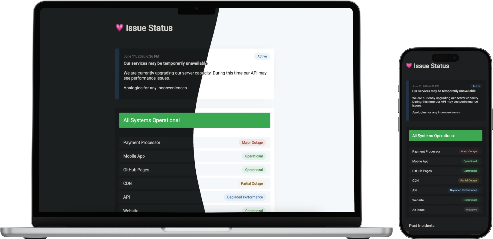

# Overhaul in progress! [You can still use version 1.1.2](https://github.com/tadhglewis/issue-status/tree/d8bc206c84f59be3feaca09a04467119895939de) or alternatively [view all previously tagged releases](https://github.com/tadhglewis/issue-status/releases)

# issue-status

A flexible, modern and blazingly fast ☄️ status page

## Features

💗 System health

📝 Incident history, scheduled maintenance and postmortems

⌨️ Pre-built templates

🌓 Dark mode (theming)

🛜 Hosted on GitHub Pages and more

✍️ Markdown support

🔴 Live updates

## Demo

[**View demo now!**](https://tadhglewis.github.io/issue-status)

This demo is hosted on GitHub Pages and using the GitHub [provider](#providers).

## Templates

Pre-built incident templates are included to quickly provide updates on an incident. These templates are available when creating a GitHub Issue.

You may [modify templates](./.github/ISSUE_TEMPLATE/) to suit your needs.

## Providers

The data fetching layer is separated into so called _Providers_. This allows you to swap out the underlying data source that powers the frontend.

Currently, only the following providers are supported:

- GitHub - uses the GitHub API and GitHub Issues as a source.
- Static - a testing provider with static data.

**Contributions:** If you have created a custom provider which may have value to others, please feel free to reach out to discuss including it in this project.

## Theming

Currently, there are two available themes which will automatically be applied based on the users system preferences:

- `light`
- `dark`

Theming tokens are available for editing in the [themes](./src/app/themes.ts) file.
